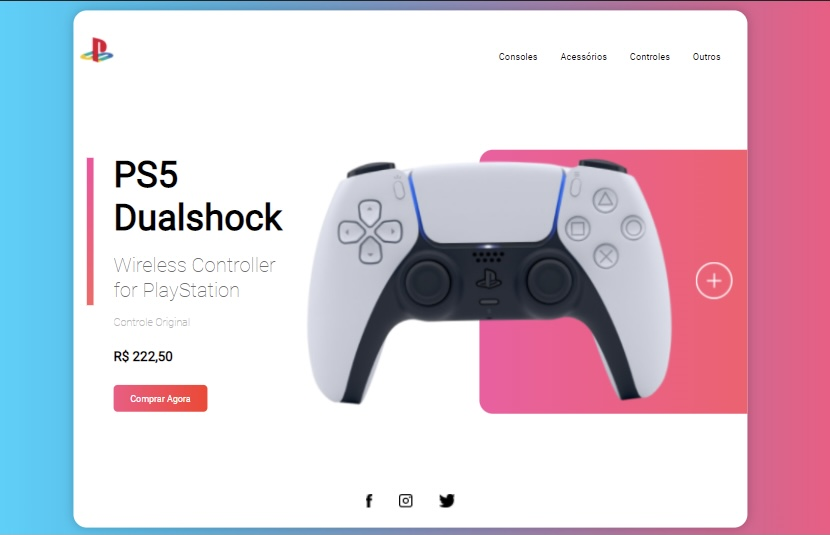

# Projeto Playstation 

> Projeto pessoal desenvolvido com o objetivo de desenvolver e aprimorar habilidades com HTML, CSS, JS e responsividade da interface.

### Interface Responsiva

> A imagem acima demonstra como o site se adequa a interface mobile.

### Ajustes e melhorias

O projeto ainda está em desenvolvimento e as próximas atualizações serão voltadas nas seguintes tarefas:

- [x] Criação responsiva
- [x] Utilização de keyframes 
- [ ] Criação do Back-end
- [ ] Criação do Gateway 

